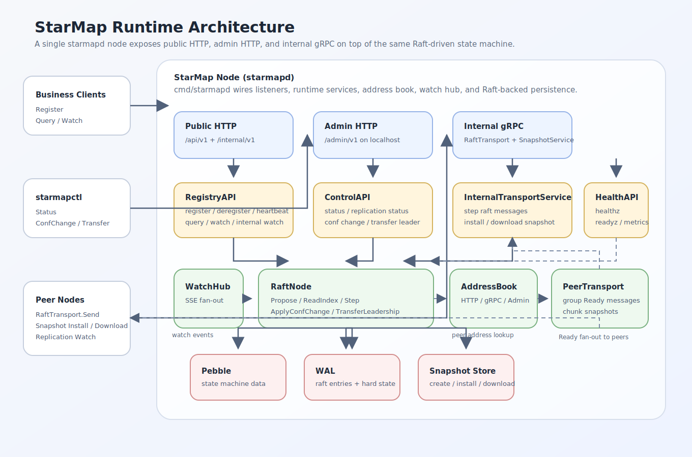
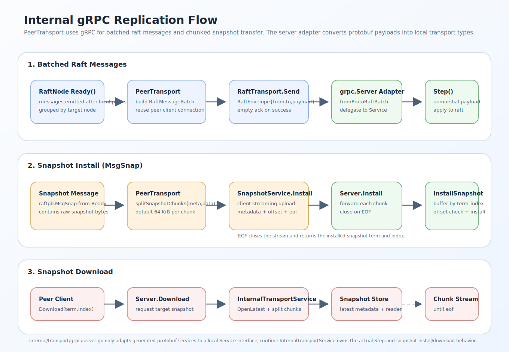
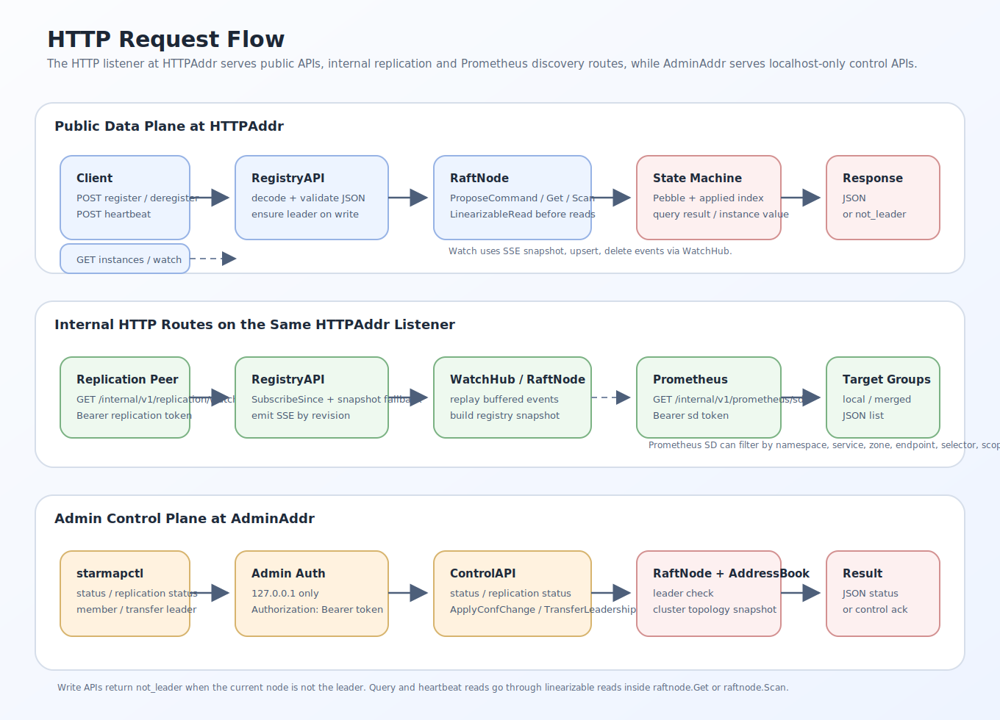

# StellMap

`StellMap` 是 `Stellar Axis` 体系中的注册中心，中文名 星轴。

它的职责很直接：为分布式系统中的服务实例提供统一的注册、发现与定位能力，让调用方能够在运行时找到目标服务，并基于一致的元数据完成路由与治理协作。

## 名字由来

### StellMap

`StellMap` 的字面含义是“星图”或“星位坐标图”。

对于注册中心来说，这个名字对应的是它在系统中的核心角色：

- 每个服务实例都像星图中的一个坐标点
- 注册中心负责维护这些坐标点的当前位置和状态
- 调用方通过这张“星图”完成服务发现、定位与导航

也就是说，`StellMap` 不是简单的地址簿，而是整个服务体系的统一坐标系。

## 仓库定位

当前仓库用于承载 `StellMap` 的 Go 实现。

按照注册中心的职责，这个仓库后续将逐步演进出以下能力：

- 服务注册
- 服务发现
- 实例心跳与健康状态维护
- 服务元数据管理
- 命名空间与分组隔离
- 与治理、配置、控制面等模块的协作接口

## 设计目标

`StellMap` 的目标不是做一个“大而全”的配置/协调系统，而是做一个轻量级、高可用、高并发、强一致的注册中心。

- 一致性优先：采用 `CP` 架构，优先保证线性一致与正确性
- 轻量级：单个 Raft Group 即可承载整个注册中心数据面
- 高可用：基于多数派存活对外提供服务
- 高并发：读写路径尽量短，减少额外抽象层
- 易恢复：崩溃恢复链路清晰，存储职责边界明确
- 易演进：后续可扩展 watch、lease、压缩、分层缓存等能力

## 总体架构

当前实现中的 `stellmapd` 由公共 `HTTP`、独立 `admin HTTP` 和内部 `gRPC` 三个监听面组成，整体运行关系如下：



### 共识层

`StellMap` 的注册中心集群采用单 `Raft` 组，基于 [`etcd-io/raft`](https://github.com/etcd-io/raft) 实现复制状态机。

这样设计的原因很直接：

- 注册中心的核心对象是服务实例记录
- 元数据规模通常远小于通用数据库
- 单 Raft 组可以显著降低实现复杂度
- 对注册中心来说，一致性、可维护性通常比水平分片更重要

单 Raft 并不意味着单点。实际部署仍然是多节点副本集群，只是整个数据空间由同一个共识组管理。

### 数据模型

`StellMap` 对外提供的是“实例注册表”模型，而不是通用 `KV` 产品。

- 逻辑主键：`namespace / service / instanceId`
- 实例内容：保存端点、标签、元数据、租约 TTL、最近心跳等注册信息
- 对外语义：调用方按“注册实例、查询候选集、续约、watch 变化”来使用系统
- 对内实现：底层仍然会编码成稳定的键值记录，便于复制、恢复和快照

其中：

- `namespace` 负责隔离环境、租户或区域边界
- `service` 是规范化后的完整服务名
- 完整服务名支持多层级组织结构：`organization.businessDomain.capabilityDomain.application.role`
- 结构化字段和规范化服务名同时保留，便于做前缀订阅、权限治理和监控聚合

这种设计便于：

- 直接映射到 Raft 提交后的实例变更 apply 流程
- 简化日志复制、快照恢复和实例过期清理
- 支持按服务维度查询候选实例、按标签筛选、按事件流 watch 等注册中心能力

## 一致性模型

### CP 架构

`StellMap` 明确采用 `CP` 架构。

- 当网络分区发生时，少数派节点停止提供线性一致写服务
- 集群优先保证数据不分叉、不回退、不读旧值
- 只有多数派存活并完成选主后，系统才继续接受写入

这意味着在极端故障场景下，系统宁可短暂不可写，也不会牺牲一致性去换取“看起来可用”。

### 读请求必须线性一致

所有读请求都必须是线性一致读，不提供默认的 stale read。

实现路径：

- 外部读请求统一进入 `raftnode.LinearizableRead`
- `LinearizableRead` 内部通过 `ReadIndex` 申请读屏障
- 状态机 `appliedIndex >= readIndex` 后再从本地状态机读取

这样做的好处是：

- 不依赖本地时间，不引入租约时钟漂移问题
- 读路径仍然较短
- 可以严格满足注册中心对最新实例视图的要求

如果请求落到 Follower，`ReadIndex` 仍会通过 `Raft` 路径完成领导权确认，随后在本地状态机上返回线性一致结果。

## Membership 变更

节点成员变更需要支持：

- `Learner`
- `Joint Consensus`

具体策略：

- 新节点先以 `Learner` 身份加入，只接收日志、不参与投票
- 等日志追平并完成必要健康检查后，再提升为正式投票节点
- 多节点拓扑变更使用 `ConfChangeV2` 和 `Joint Consensus`，避免直接切换带来的多数派抖动风险

这样设计可以保证：

- 扩容过程不因慢节点立刻影响法定多数
- 缩容与替换节点时，共识配置切换有明确过渡态
- 与 `etcd-io/raft` 的现代成员变更机制保持一致

## 存储设计

`StellMap` 将持久化职责拆为三部分：

- `WAL`：存储 Raft Log
- `Pebble`：存储实例注册表数据与少量本地元数据
- `Snapshot`：独立快照文件

职责拆分后的目录示意如下：

```text
data/
  wal/
    0000000000000001.wal
    0000000000000002.wal
  pebble/
    MANIFEST-000001
    CURRENT
    *.sst
    *.log
  snapshot/
    snapshot-0000000000001234-0000000000005678.snap
    snapshot-0000000000001234-0000000000005678.meta
```

### 1. WAL：Raft Log

`WAL` 只负责 Raft 复制日志及必要的持久化共识元数据，例如：

- `Entry`
- `HardState`
- 快照点位引用信息

这样可以确保：

- Raft 顺序追加语义清晰
- 写入模式稳定，便于批量刷盘
- 共识日志与状态机数据解耦，恢复流程更容易实现

### 2. Pebble：实例注册表数据 + 少量元数据

`Pebble` 不保存完整 Raft Log，只保存：

- apply 后的实例注册数据
- 少量本地元数据，例如最近一次 apply 的 index / term、当前使用中的 snapshot 元信息，以及租约、压缩点、水位等后续需要持久化的少量控制信息

这样可以避免把 Raft 日志和注册表数据混合到一个引擎里，降低 compaction、恢复和空间管理的耦合度。

### 3. Snapshot：独立文件

快照采用独立文件而不是直接混在 Pebble 中，原因是：

- 快照本质上是一个状态截面，天然适合独立版本化管理
- 便于流式传输、校验、落盘和原子替换
- 便于做下载中断恢复、文件级校验和历史清理

快照文件中通常包含：

- 快照元信息：term、index、conf state、checksum
- 状态机导出的实例注册表数据
- 必要的扩展元数据

## 为什么选择 Pebble

`Pebble` 是 `CockroachDB` 开源的 Go 原生 LSM `key-value` 引擎。

官方资料：

- GitHub README：<https://github.com/cockroachdb/pebble>
- Go Package 文档：<https://pkg.go.dev/github.com/cockroachdb/pebble>

官方文档中明确提到：

- Pebble 是一个受 `LevelDB/RocksDB` 启发的 `key-value store`
- 它聚焦性能，并已在 `CockroachDB` 中大规模生产使用
- 它提供了更快的 commit pipeline、更好的并发能力，以及更小、更易维护的代码基线

### 采用 Pebble 的原因

对 `StellMap` 来说，Pebble 很契合注册中心场景：

- Go 原生实现，无需引入 `cgo`
- 顺序写和读放大控制能力较强，适合高频注册/心跳更新
- 支持范围删除、快照、批量写，便于实现实例清理、快照与批量 apply
- 工程成熟度较高，已在生产环境长期使用
- 能很好承载“实例注册表记录 + 少量元数据”这类结构化但不复杂的数据形态

### 优点

- Go 原生，部署与交叉编译友好
- 写入并发能力强，适合高并发元数据更新
- LSM 结构适合注册中心这类读多写多、key 前缀明显的数据
- 对按服务扫描实例、按标签筛选前的候选集读取、批量 apply 比较友好
- 社区与工业实践较成熟，维护成本低于自研存储引擎

### 缺点

- 仍然是 LSM，引入 compaction、写放大、空间放大等典型问题
- 不提供完整关系查询能力，复杂检索需要上层编码设计
- 不适合作为 Raft Log 的唯一承载介质，否则日志与状态机生命周期会互相干扰
- 与 RocksDB 虽兼容部分格式，但并非完整替代，迁移时需遵守官方兼容边界

### 对比

| 方案 | 优点 | 缺点 | 结论 |
| --- | --- | --- | --- |
| `Pebble` | Go 原生、性能好、成熟、适合承载注册表数据 | 有 compaction 成本 | 适合作为实例注册表存储 |
| `bbolt` | 实现简单、单文件、易理解 | 单写者模型明显，不适合高并发写 | 不适合高并发注册中心 |
| `Badger` | Go 原生、KV 能力完整 | 值日志与 GC 运维复杂度更高 | 可用，但对注册表状态管理的可控性不如 Pebble 直接 |
| `RocksDB` | 生态成熟、能力丰富 | 依赖 `cgo`，运维和构建链更重 | 对轻量级 Go 项目过重 |

因此，`StellMap` 选择：

- `WAL` 负责 Raft 日志
- `Pebble` 负责实例注册表数据与少量本地元数据
- `Snapshot` 负责截面恢复

而不是把三类职责全部压进单一存储组件。

## 读写流程

### 写请求

1. 客户端通过 `HTTP API` 发起注册、注销或心跳续约请求
2. 非 Leader 节点重定向或转发到 Leader
3. Leader 将实例变更命令编码为 proposal，提交给单 Raft 组
4. 日志追加到本地 `WAL`
5. 日志复制到多数派并提交
6. 状态机按顺序 apply 到 `Pebble`
7. 返回写成功结果

### 读请求

1. 客户端发起实例查询请求
2. 请求到达 Leader，或被 Follower 转发到 Leader
3. Leader 执行 `ReadIndex`
4. 等待本地 `appliedIndex` 追平到 `readIndex`
5. 从 `Pebble` 读取最新实例注册表视图
6. 返回线性一致结果

## 通信设计

### 外部 API

对三方业务接入只提供公共 `HTTP API`。

对外 `HTTP API` 的价值：

- 降低接入门槛
- 方便脚本、Sidecar 和多语言客户端调用
- 适合注册、注销、查询、健康上报等开放接口

### 管理面 API

成员变更、Leader 转移和集群状态查询不挂在公共 HTTP listener 上，而是挂在独立的 `admin HTTP` listener 上。

设计约束：

- 公共 `HTTP` 只承载业务数据面和健康检查
- `admin HTTP` 只承载控制面动作，默认绑定到本地回环地址，例如 `127.0.0.1:18080`
- `admin HTTP` 当前额外强制只接受来源为 `127.0.0.1` 的请求
- `admin HTTP` 需要固定 token 鉴权，请求头格式为 `Authorization: Bearer <token>`
- `stellmapctl` 是控制面的唯一入口
- 这意味着当前控制面默认只支持本机运维；如需跨机器运维，需要后续单独放宽来源限制并补更完整鉴权

### 内部 Transport

集群内部复制面统一采用 `gRPC`。

这样设计的原因：

- 内外通信面职责不同，不应共用同一套协议假设
- 单 Raft 集群内部需要承载 Raft message、快照、Leader 转发等协议
- `gRPC` 对内部机器间通信更适合，协议清晰、强类型、支持流式快照传输

内部 transport 主要承载：

- Raft message 传输
- Snapshot 文件/分片传输
- Leader 转发读写请求
- 节点管理与健康探测

策略：

- 外部开放面只提供 `HTTP API`
- 内部复制面统一使用 `gRPC`
- 外部 HTTP 与内部 `gRPC` 共享同一套核心状态机与权限校验逻辑，避免双份实现

## 崩溃恢复流程

`StellMap` 的恢复顺序需要严格围绕 `Snapshot -> Pebble -> WAL Replay` 展开。

### 启动恢复步骤

1. 读取本地最新快照元信息
2. 如果存在有效快照，则先恢复快照文件到状态机工作目录
3. 打开 `Pebble`，加载实例注册表数据和本地元数据
4. 打开 `WAL`，读取 `HardState`、`Entry` 和快照点位
5. 根据快照 index 丢弃已被快照覆盖的旧日志
6. 将剩余未 apply 的 committed entries 依序 apply 到状态机
7. 重建内存中的 Raft 节点、apply watermarks、membership 视图
8. 对外进入可服务状态

### 崩溃点处理原则

- 如果 WAL 已持久化但状态机未来得及 apply，重启后按日志重放
- 如果快照文件已生成但元信息未原子切换，则仍以旧快照为准
- 如果 Pebble 中保存的 applied index 落后于 WAL committed index，则继续补 apply
- 如果发现快照、WAL、状态机三者 index 不一致，优先保证“不回退已提交日志”的原则

### 恢复后的校验项

- `HardState.Commit >= appliedIndex`
- 状态机记录的 `appliedIndex` 不超过 WAL 中的最大 committed index
- 快照中的 `ConfState` 与恢复后内存 membership 一致
- 当前节点是否仍在最新 membership 中
- 是否需要继续从 Leader 拉取缺失日志或安装新快照

## 快照与日志压缩

为避免 Raft Log 无限增长，需要周期性生成快照并截断旧日志。

基本策略：

- 当 `appliedIndex - snapshotIndex` 超过阈值时触发快照
- 快照生成后，原子写入快照元数据
- WAL 仅保留快照点之后的必要日志
- 新节点或落后节点优先走日志追平，差距过大时改走快照安装

## 一致性与故障测试

`StellMap` 必须把一致性验证和故障注入作为核心测试内容，而不是补充项。

### 一致性测试

- 线性一致读测试：并发写入后，所有成功读必须观察到满足实时顺序的最新值
- 单调读测试：同一客户端连续读取不得回退
- 写后读测试：写成功返回后，后续线性一致读必须可见
- 实例候选集一致性测试：查询结果必须对应某个线性一致时间点
- Leader 切换测试：选主前后不得出现已确认写丢失

### Membership 测试

- `Learner` 加入后只能同步日志，不能参与投票
- `Learner` 追平后提升为 Voter
- `Joint Consensus` 过程中任一阶段都保持多数派语义正确
- 节点替换、缩容、扩容后数据和配置一致

### 故障测试

- Leader 崩溃并重启
- Follower 崩溃并重启
- 多节点重启后的恢复顺序测试
- WAL 损坏、快照损坏、部分文件缺失的恢复策略测试
- 网络分区测试：多数派可继续服务，少数派拒绝线性一致写
- 磁盘慢写/刷盘抖动测试
- Snapshot 传输中断与续传/重试测试

### 压力与稳定性测试

- 高频注册/注销压测
- 高频心跳续约压测
- 大量实例查询与 watch 场景压测
- 长时间 soak test，观察 compaction、fd、内存和尾延迟

## 模块划分

### `raftnode`

`raftnode` 是整个系统的共识核心，负责把 `etcd-io/raft` 驱动成可运行的复制状态机。

主要职责：

- 初始化 `raft.Config`、`MemoryStorage` 与持久化状态
- 驱动 tick、campaign、propose、step、advance 生命周期
- 处理 `Ready` 批次中的 `Entries`、`CommittedEntries`、`Messages`、`Snapshot`
- 对接 `wal`、`snapshot`、`storage`
- 提供线性一致读所需的 `ReadIndex` 能力
- 处理 `Learner`、`ConfChangeV2`、`Joint Consensus`

### `wal`

`wal` 负责 Raft Log 的持久化，不承担注册表数据存储职责。

主要职责：

- 顺序追加 `Entry`
- 持久化 `HardState`
- 管理 segment 切换、刷盘、截断
- 启动时扫描并恢复可用日志段
- 提供 WAL 损坏检测和有限修复能力

核心接口：

```go
type WAL interface {
    Open(ctx context.Context) error
    Append(ctx context.Context, state raftpb.HardState, entries []raftpb.Entry) error
    Load(ctx context.Context) (raftpb.HardState, []raftpb.Entry, error)
    TruncatePrefix(ctx context.Context, index uint64) error
    Sync(ctx context.Context) error
    Close(ctx context.Context) error
}
```

### `snapshot`

`snapshot` 负责快照导出、安装、校验与切换。

主要职责：

- 从状态机导出快照文件
- 维护快照元数据：`term/index/conf_state/checksum`
- 安装远端快照并原子落盘
- 提供 snapshot stream 的读写支持
- 控制快照保留策略和清理策略

核心接口：

```go
type SnapshotStore interface {
    Create(ctx context.Context, meta Metadata, exporter Exporter) (Metadata, error)
    OpenLatest(ctx context.Context) (Metadata, io.ReadCloser, error)
    Install(ctx context.Context, meta Metadata, r io.Reader) error
    Cleanup(ctx context.Context, keep int) error
}
```

### `storage`

`storage` 基于 `Pebble` 实现实例注册表数据和少量元数据存储。

主要职责：

- 维护实例注册记录
- 维护状态机 apply 进度与本地元数据
- 提供按键读取、范围扫描、批量写、范围删除等底层能力
- 支持快照导出和快照恢复
- 保证 apply 幂等与顺序性

核心接口：

```go
type StateMachine interface {
    Apply(ctx context.Context, cmd Command) (Result, error)
    Get(ctx context.Context, key []byte) ([]byte, error)
    Scan(ctx context.Context, start, end []byte, limit int) ([]KV, error)
    Snapshot(ctx context.Context, w io.Writer) error
    Restore(ctx context.Context, r io.Reader) error
    AppliedIndex(ctx context.Context) (uint64, error)
}
```

### `transport`

`transport` 分为外部 `HTTP API` 接入面和内部 `gRPC` 复制面。

主要职责：

- 内部节点间 Raft message 传输
- Snapshot 流式同步
- Follower 到 Leader 的读写转发
- 对三方客户端暴露注册、发现、健康接口

子模块：

- `transport/http`：公共 HTTP 数据面与独立 admin HTTP 控制面
- `transport/grpc`：节点间复制、转发、快照同步的内部实现

## 模块协作关系

`cmd/stellmapd/main.go` 当前会同时装配三套监听面：

- 公共 `HTTP`：`httptransport.NewPublicServer(registryHandler, health)`，承载 `/api/v1`、`/internal/v1`、`/healthz`、`/readyz`、`/metrics`
- 独立 `admin HTTP`：`httptransport.NewAdminServer(control)`，外层再包一层 `adminAuthMiddleware`
- 内部 `gRPC`：`grpctransport.NewServer(internalService).RegisterHandlers(grpcServer)`

核心调用方向如下：

- `RegistryAPI` 负责公共注册发现接口、内部复制 watch 和 Prometheus SD
- `HealthAPI` 负责健康检查与指标暴露
- `ControlAPI` 负责集群状态、复制状态、成员变更和 Leader 转移
- `grpctransport.Server` 只做 protobuf server 适配，实际逻辑由 `runtime.InternalTransportService` 执行
- `runtime.PeerTransport` 消费 `raftnode.Ready()`，按目标节点分组发送 `RaftMessageBatch`，并对 `MsgSnap` 执行快照分片传输
- `raftnode` 是统一入口：写请求走 `ProposeCommand`，读请求走 `Get/Scan` 的线性一致读路径，成员变更走 `ApplyConfChange`

约束原则：

- `transport/http` 和 `transport/grpc` 都不直接改 `Pebble`
- 业务写入统一经由 `raftnode.ProposeCommand`
- 线性一致读由 `raftnode.LinearizableRead + storage.Get/Scan` 组合完成
- `wal` 不依赖 `storage`
- `snapshot` 可以调用 `storage` 导出和恢复，但不反向依赖 `raftnode`

## 内部 gRPC 协议

内部复制协议固定由 `api/proto/stellmap/v1/raft.proto` 和 `api/proto/stellmap/v1/snapshot.proto` 定义，只用于节点间通信，不对外部业务客户端开放。

### 服务定义

| 服务 | RPC | 方向 | 说明 |
| --- | --- | --- | --- |
| `RaftTransport` | `Send(RaftMessageBatch) returns (RaftMessageAck)` | Unary | 批量发送普通 `Raft` 消息 |
| `SnapshotService` | `Install(stream InstallSnapshotChunk) returns (InstallSnapshotResponse)` | Client Streaming | 上传快照分片并在 EOF 时安装 |
| `SnapshotService` | `Download(DownloadSnapshotRequest) returns (stream DownloadSnapshotChunk)` | Server Streaming | 按 `term/index` 下载快照 |

### 消息模型

- `RaftEnvelope`：字段为 `from`、`to`、`payload`，其中 `payload` 是序列化后的 `raftpb.Message`
- `RaftMessageBatch`：同一目标节点的一批 `RaftEnvelope`
- `SnapshotMetadata`：包含 `term`、`index`、`conf_state`、`checksum`、`file_size`
- `SnapshotChunk`：包含 `metadata`、`data`、`offset`、`eof`

### 实现对应关系

- [internal/transport/grpc/server.go](internal/transport/grpc/server.go) 同时注册 `RaftTransport` 与 `SnapshotService`，并把 protobuf 类型转换为本地 `RaftMessageBatch` / `SnapshotChunk`
- [internal/runtime/transport_service.go](internal/runtime/transport_service.go) 中的 `InternalTransportService` 负责真正的消息处理：`SendRaftMessages` 调 `node.Step`，`InstallSnapshotChunk` 在内存中按 `term-index` 聚合分片，`DownloadSnapshot` 从本地快照存储切块返回
- [internal/runtime/peer_transport.go](internal/runtime/peer_transport.go) 会把 `Ready.Messages` 按目标节点分组；普通消息走 `Client.Send`，`MsgSnap` 走 `splitSnapshotChunks + Client.InstallSnapshot`



## 控制面设计

成员变更、Leader 转移和集群状态查看统一由 `stellmapctl` 触发，但底层执行路径仍然是 `stellmapd` 的独立 `admin HTTP` listener。

当前控制面边界：

- 公共业务客户端只访问 `HTTPAddr`
- `stellmapctl` 默认访问本地 `AdminAddr`
- `admin` 请求必须同时满足“来源地址是 `127.0.0.1`”和“携带 `Authorization: Bearer <token>`”
- `PeerAdminAddrs` 只用于 Leader 跟随和控制面状态展示，不接受远端直接访问

控制面路由如下：

| 方法 | 路径 | 说明 |
| --- | --- | --- |
| `GET` | `/admin/v1/status` | 返回当前节点视角下的集群状态 |
| `GET` | `/admin/v1/replication/status` | 返回当前复制任务状态 |
| `POST` | `/admin/v1/members/add-learner` | 新增 learner |
| `POST` | `/admin/v1/members/promote` | 提升 learner |
| `POST` | `/admin/v1/members/remove` | 移除成员 |
| `POST` | `/admin/v1/leader/transfer` | 主动触发 Leader 转移 |

常用命令：

- `stellmapctl member add-learner`
- `stellmapctl member promote`
- `stellmapctl member remove`
- `stellmapctl leader transfer`
- `stellmapctl status`

## HTTP API

`StellMap` 的 `HTTPAddr` 监听面同时承载三类路由：

- 公共注册发现数据面：`/api/v1`
- 内部复制与监控辅助接口：`/internal/v1`
- 健康检查与指标：`/healthz`、`/readyz`、`/metrics`

独立的 `AdminAddr` 只承载 `/admin/v1` 控制面。



### 公共注册与发现接口

| 方法 | 路径 | 说明 |
| --- | --- | --- |
| `POST` | `/api/v1/registry/register` | 注册实例；非 Leader 返回 `503 not_leader` |
| `POST` | `/api/v1/registry/deregister` | 注销实例；非 Leader 返回 `503 not_leader` |
| `POST` | `/api/v1/registry/heartbeat` | 续约实例；会先线性一致读取当前实例，再提交更新 |
| `GET` | `/api/v1/registry/instances` | 按条件线性一致查询实例候选集 |
| `GET` | `/api/v1/registry/watch` | 通过 SSE 推送 `snapshot` / `upsert` / `delete` 事件 |

### 内部 HTTP 接口

| 方法 | 路径 | 说明 |
| --- | --- | --- |
| `GET` | `/internal/v1/replication/watch` | 跨 region 目录同步专用 SSE；需要 `Bearer <replication_token>` |
| `GET` | `/internal/v1/prometheus/sd` | Prometheus HTTP SD；需要 `Bearer <prometheus_sd_token>` |

`/internal/v1/replication/watch` 的行为：

- 支持 `namespace`、`service`、`zone`、`endpoint`、`selector`、`label` 等筛选参数
- 支持 `sinceRevision`；命中本地 replay 缓冲时直接回放，否则先发一条 `snapshot`
- 返回类型为 `text/event-stream`

`/internal/v1/prometheus/sd` 的行为：

- 返回 Prometheus 兼容的 target group JSON
- 支持 `namespace`、`service`、`zone`、`endpoint`、`scope`、`includeSelf`、`selector`、`label`
- `scope` 当前支持 `local` 和 `merged`
- `endpoint` 默认值为 `metrics`

Prometheus 最小接入示例：

```yaml
scrape_configs:
  - job_name: stellmap-services
    http_sd_configs:
      - url: http://10.0.0.11:8080/internal/v1/prometheus/sd?endpoint=metrics
        refresh_interval: 30s
        authorization:
          type: Bearer
          credentials: stellmap
```

对应返回示例：

```json
[
  {
    "targets": ["10.0.0.11:9090"],
    "labels": {
      "namespace": "prod",
      "service": "order-service",
      "instance_id": "order-1",
      "region": "cn-sh",
      "zone": "az1",
      "cluster_id": "100",
      "target_kind": "service_instance",
      "__scheme__": "http",
      "__metrics_path__": "/metrics"
    }
  }
]
```

### 健康与调试接口

| 方法 | 路径 | 说明 |
| --- | --- | --- |
| `GET` | `/healthz` | 返回进程存活状态以及当前 `leaderId` / `leaderAddr` |
| `GET` | `/readyz` | 节点已启动、未停止，且已经具备可服务的 `Raft` 状态时返回 ready |
| `GET` | `/metrics` | 暴露 Prometheus 文本指标 |

### 注册模型说明

当前注册中心把“一个实例”建模为：

- 稳定身份：`namespace`、`service`、`instanceId`
- 结构化服务标识：`organization`、`businessDomain`、`capabilityDomain`、`application`、`role`
- 实例属性：`zone`、`labels`、`metadata`
- 协议入口：`endpoints[]`
- 租约属性：`leaseTtlSeconds`

字段约定：

- `namespace`：稳定业务隔离域，例如 `prod`、`staging`、`tenant-a`
- `service`：规范化服务名，例如 `company.trade.order.order-center.api`
- `organization`：组织标识，例如 `company`
- `businessDomain`：业务域，例如 `trade`
- `capabilityDomain`：能力域，例如 `order`
- `application`：应用名，例如 `order-center`
- `role`：应用角色，例如 `api`、`worker`
- `instanceId`：实例唯一标识
- `zone`：实例所在可用区，例如 `az1`
- `labels`：低基数治理标签，例如 `color=gray`、`version=v2`
- `metadata`：补充描述信息，例如 `build_sha=abc123`
- `endpoints[].name`：实例内端点名；为空时服务端会补成 `protocol`
- `endpoints[].protocol`：端点协议，例如 `http`、`grpc`、`tcp`
- `endpoints[].host` / `endpoints[].port`：协议入口地址
- `endpoints[].path`：可选路径，常用于 `metrics` 这类 `HTTP` 端点
- `endpoints[].weight`：端点权重；未显式填写时，服务端默认补为 `100`
- `leaseTtlSeconds`：实例租约 TTL；未显式填写或填写 `0` 时，服务端默认补为 `30`

多层级服务标识约定：

- `service` 与 `organization.businessDomain.capabilityDomain.application.role` 必须一致
- 如果请求体里未显式填写 `service`，服务端会根据五段结构化字段自动组合出规范化服务名
- 如果只传了 `service`，服务端会反向解析结构化字段
- 五段结构必须完整；不支持跳层，例如只传 `organization` 和 `application`

注册请求示例：

```json
{
  "namespace": "prod",
  "organization": "company",
  "businessDomain": "trade",
  "capabilityDomain": "order",
  "application": "order-center",
  "role": "api",
  "service": "company.trade.order.order-center.api",
  "instanceId": "order-center-api-10.0.1.23",
  "zone": "az1",
  "labels": {
    "color": "gray",
    "version": "v2"
  },
  "metadata": {
    "build_sha": "abc123",
    "owner": "trade-team"
  },
  "endpoints": [
    {
      "name": "http",
      "protocol": "http",
      "host": "10.0.1.23",
      "port": 8080,
      "weight": 100
    },
    {
      "name": "metrics",
      "protocol": "http",
      "host": "10.0.1.23",
      "port": 8080,
      "path": "/metrics",
      "weight": 100
    },
    {
      "name": "grpc",
      "protocol": "grpc",
      "host": "10.0.1.23",
      "port": 9090,
      "weight": 100
    }
  ],
  "leaseTtlSeconds": 30
}
```

心跳请求示例：

```json
{
  "namespace": "prod",
  "service": "company.trade.order.order-center.api",
  "instanceId": "order-center-api-10.0.1.23",
  "leaseTtlSeconds": 30
}
```

实例查询示例：

```text
GET /api/v1/registry/instances?namespace=prod&service=company.trade.order.order-center.api&zone=az1&endpoint=http&selector=color=gray,version%20in%20(v2),!deprecated
GET /api/v1/registry/instances?namespace=prod&servicePrefix=company.trade.order&endpoint=http
GET /api/v1/registry/instances?namespace=prod&organization=company&businessDomain=trade&capabilityDomain=order
```

实例 watch 示例：

```text
GET /api/v1/registry/watch?namespace=prod&service=company.trade.order.order-center.api&selector=color=gray,version%20in%20(v2)
GET /api/v1/registry/watch?namespace=prod&servicePrefix=company.trade.order&includeSnapshot=true
GET /api/v1/registry/watch?namespace=prod&servicePrefix=company.trade.order&sinceRevision=1024&includeSnapshot=false
```

watch 约定：

- 返回类型为 `text/event-stream`
- 建连后先推送一条 `snapshot` 事件，携带当前候选实例全集
- 后续实例新增或更新时推送 `upsert`
- 后续实例删除或不再满足当前筛选条件时推送 `delete`
- 每条事件都带 `revision`，对应底层已提交日志索引
- `sinceRevision` 表示客户端已经成功处理到的最后一个目录版本号；服务端会尽量回放这个版本之后仍在本地缓冲窗口内的增量事件
- `includeSnapshot=true` 时，如果 `sinceRevision` 不可恢复或首次建连，服务端会先下发一次 `snapshot`
- `includeSnapshot=false` 且 `sinceRevision` 已经超出本地保留窗口时，服务端返回 `410 revision_expired`
- 对 watch 来说，`revision` 的意义是事件流恢复游标，不是大文件断点续传

查询约定：

- `namespace`：必填
- `service`：可选，表示一个规范化完整服务名；可重复传多个 `service`
- `servicePrefix`：可选，可重复；用于匹配规范化服务名的前缀，例如 `company.trade.order`
- `organization`、`businessDomain`、`capabilityDomain`、`application`、`role`：可选；如果五段都给齐，会等价为一个精确 `service`，如果只给连续前缀段，会自动转成一个 `servicePrefix`
- `zone`：可选
- `endpoint`：可选，兼容端点名或协议名匹配
- `selector`：可选，支持 `key`、`!key`、`key=value`、`key!=value`、`key in (v1,v2)`、`key notin (v1,v2)`
- `label`：兼容旧参数，可重复，格式 `label=key=value`
- `limit`：可选，仅限制最终返回候选集数量

`selector` 接入说明：

- 单个 `selector` 参数内可以用顶层逗号组合多个条件，例如 `selector=color=gray,version in (v2),!deprecated`
- 也可以重复传多个 `selector` 参数；服务端会把所有表达式按 `AND` 合并
- `in/notin` 必须带括号，例如 `version in (v2,v3)`、`env notin (test,dev)`
- 兼容参数 `label` 适合老 SDK 迁移，例如 `label=color=gray&label=version=v2`

示例：

```text
GET /api/v1/registry/instances?namespace=prod&service=company.trade.order.order-center.api&selector=color=gray,version%20in%20(v2),!deprecated
GET /api/v1/registry/instances?namespace=prod&servicePrefix=company.trade.order&selector=env%20in%20(prod,staging)&selector=tier=core
GET /api/v1/registry/instances?namespace=prod&organization=company&businessDomain=trade&capabilityDomain=order&label=color=gray&label=version=v2
```

常见错误示例：

```text
selector=version in v2
selector=color=
selector=color=gray,,version=v2
```

对应这类非法输入，服务端会返回 `400 bad_request`，并在 `message` 中附带支持语法和示例，便于 SDK 直接透传或映射。例如：

```json
{
  "code": "bad_request",
  "message": "invalid selector \"version in v2\": expected values like (v1,v2); supported selector syntax: key, !key, key=value, key!=value, key in (v1,v2), key notin (v1,v2); valid example: selector=color=gray,version in (v2),!deprecated; invalid example: selector=version in v2"
}
```

当前边界：

- 服务端只负责过滤候选集，不负责按权重做最终实例选择
- 权重会随端点信息一起返回，交给客户端 SDK、网关或 sidecar 做本地流量决策
- 查询接口默认跳过已经超过租约 TTL 且未续约的实例
- 过期实例会由 Leader 在后台周期性扫描并通过 `Raft delete proposal` 真正清理出存储，而不只是查询时隐藏
- 后台扫描周期可通过 `--registry-cleanup-interval` 调整
- 单轮后台清理删除上限可通过 `--registry-cleanup-delete-limit` 调整

### 配置方式

当前通过 `TOML` 配置文件启动 `stellmapd`，命令行参数只用于覆盖配置文件里的个别字段。

优先级规则：

1. 命令行参数
2. `--config` 指定的 `TOML` 配置文件
3. 剩余字段必须显式提供，否则启动时报错

启动方式：

```bash
./stellmapd --config=./config/stellmapd.toml
```

安装脚本使用的配置模板可参考：

- [stellmapd.toml](E:\PersonalCode\GoProject\StellMap\config\stellmapd.toml)

注意：

- 上面的 [stellmapd.toml](E:\PersonalCode\GoProject\StellMap\config\stellmapd.toml) 现在是安装脚本使用的占位符模板
- 直接手工启动时，请参考下面这份“真实可用”的配置内容填写自己的节点参数

一个最小示例如下：

```toml
[node]
id = 1
cluster_id = 100
region = "default"
data_dir = "data/node-1"

[server]
http_addr = "0.0.0.0:8080"
admin_addr = "127.0.0.1:18080"
grpc_addr = "0.0.0.0:19090"

[auth]
admin_token = "stellmap"
replication_token = "stellmap"
prometheus_sd_token = "stellmap"

[cluster]
peer_ids = "1,2,3"
peer_grpc_addrs = "1=10.0.0.11:19090,2=10.0.0.12:19090,3=10.0.0.13:19090"
peer_http_addrs = "1=10.0.0.11:8080,2=10.0.0.12:8080,3=10.0.0.13:8080"
peer_admin_addrs = "1=127.0.0.1:18080,2=127.0.0.1:18080,3=127.0.0.1:18080"

[runtime]
request_timeout = "5s"
shutdown_timeout = "10s"

[registry]
cleanup_interval = "1s"
cleanup_delete_limit = 128

[replication]
targets_file = "/etc/stellmapd/stellmapd-node-1-replication-targets.json"
```

说明：

- `admin_token`、`replication_token`、`prometheus_sd_token` 现在都可以直接放在配置文件里
- 命令行参数仍然可以覆盖配置文件，例如：

```bash
./stellmapd --config=./config/stellmapd.toml --http-addr=:28080 --admin-token=new-token
```

### HTTP 返回模型

统一响应格式如下，便于 SDK 和控制台处理：

```json
{
  "code": "ok",
  "message": "",
  "data": {},
  "requestId": "01HR..."
}
```

典型返回码包括：

- `ok`
- `bad_request`
- `not_found`
- `not_ready`
- `not_leader`
- `unauthorized`
- `forbidden`
- `read_failed`
- `scan_failed`
- `propose_failed`
- `conf_change_failed`

例外说明：

- `/api/v1/registry/watch` 和 `/internal/v1/replication/watch` 返回 `text/event-stream`
- `/internal/v1/prometheus/sd` 直接返回 Prometheus 需要的 target group JSON，不包裹统一响应结构

## 崩溃恢复模板

恢复流程可以进一步固化成实现清单，后续每个版本都按这个模板自检。

### 恢复主流程模板

```text
[Bootstrap]
1. load config
2. lock data dir
3. inspect snapshot dir
4. open pebble
5. open wal
6. rebuild raft state
7. replay committed entries
8. publish local status
9. join cluster service loop
```

### 恢复检查点模板

| 检查项 | 预期 | 失败处理 |
| --- | --- | --- |
| 最新 snapshot 元数据可读 | 能得到 `term/index/conf_state` | 标记快照损坏，回退到旧快照或进入人工修复模式 |
| Pebble 可打开 | 注册表数据目录完整 | 中止启动，避免带损继续运行 |
| WAL 可扫描 | 至少能恢复 `HardState` 和可用 `Entry` | 尝试 repair；失败则拒绝启动 |
| applied index 合法 | `appliedIndex <= commitIndex` | 拒绝启动并报警 |
| ConfState 一致 | 快照/WAL/内存成员视图一致 | 进入只恢复不对外服务模式 |
| 当前节点角色合法 | 自身仍在最新 membership 中 | 非成员节点转为只读或退出 |

### 恢复演练模板

| 场景 ID | 场景描述 | 初始条件 | 注入动作 | 预期结果 |
| --- | --- | --- | --- | --- |
| `REC-001` | WAL 已落盘，注册变更尚未 apply | 单集群正常运行 | 注册请求提交后立即 kill -9 | 重启后日志重放成功，无已提交数据丢失 |
| `REC-002` | snapshot 文件写入中断 | 触发快照生成 | 快照写到一半断电 | 启动时识别坏快照并回退到上一个有效快照 |
| `REC-003` | Follower 长时间落后 | 3 节点集群 | 阻断一个 follower 网络后恢复 | 差距小走日志追平，差距大走快照安装 |
| `REC-004` | 节点被移出 membership 后重启 | 已完成 remove node | 重启被移除节点 | 节点不得以 voter 身份重新加入 |

## 测试用例清单模板

后续可以在 `tests/` 下按这个模板维护用例矩阵。

### 1. 一致性测试模板

| 用例 ID | 用例名称 | 覆盖点 | 前置条件 | 操作步骤 | 预期结果 |
| --- | --- | --- | --- | --- | --- |
| `CONS-001` | 线性一致实例注册与查询 | `ReadIndex` | 3 节点正常 | 连续注册/续约后立即查询 | 读到最新已提交实例视图 |
| `CONS-002` | 并发写后读 | 实时顺序 | 3 节点正常 | 多客户端并发写，再并发读 | 无读旧值 |
| `CONS-003` | Leader 切换期间读一致性 | 主从切换 | 触发一次 leader 变更 | 切换前后持续读写 | 已确认写不丢失，读不回退 |

### 2. Membership 测试模板

| 用例 ID | 用例名称 | 覆盖点 | 前置条件 | 操作步骤 | 预期结果 |
| --- | --- | --- | --- | --- | --- |
| `MEM-001` | learner 加入 | learner 同步 | 3 节点正常 | 新增 learner | learner 不参与投票但能追日志 |
| `MEM-002` | learner 提升 | promote | learner 已追平 | 发起 promote | 新节点成为 voter |
| `MEM-003` | joint consensus 缩容 | `ConfChangeV2` | 5 节点正常 | 一次移除 2 节点 | 过渡阶段与完成阶段都满足多数派规则 |

### 3. 故障测试模板

| 用例 ID | 用例名称 | 覆盖点 | 前置条件 | 故障注入 | 预期结果 |
| --- | --- | --- | --- | --- | --- |
| `FAULT-001` | Leader 崩溃 | 选主恢复 | 3 节点正常 | kill 当前 leader | 新 leader 产生，集群恢复写服务 |
| `FAULT-002` | 少数派网络分区 | CP 语义 | 5 节点正常 | 切断 2 节点网络 | 多数派继续服务，少数派拒绝线性一致写 |
| `FAULT-003` | WAL 损坏 | 恢复策略 | 构造损坏段 | 启动节点 | 节点拒绝带损服务或进入 repair 流程 |

### 4. 压力测试模板

| 用例 ID | 用例名称 | 指标 | 负载模型 | 预期 |
| --- | --- | --- | --- | --- |
| `LOAD-001` | 注册写入压测 | QPS、P99、fsync latency | 高频 `Register` | 延迟稳定，无异常错误率 |
| `LOAD-002` | 心跳续约压测 | QPS、P99、compaction 频率 | 高频 `Heartbeat` | 无明显写放大失控 |
| `LOAD-003` | 服务发现查询压测 | scan latency、heap | 大量 `QueryInstances` / `Watch` | 读延迟可控，无明显内存泄漏 |

### 5. 自动化执行

- `tests/integration`：跑基础功能回归
- `tests/consistency`：跑线性一致、主切换、读写时序验证
- `tests/fault`：跑 kill、partition、disk fault、snapshot fault
- CI 先跑轻量集成测试，夜间任务再跑故障和 soak test

## 当前状态

仓库当前处于初始化阶段，后续将逐步补充：

- 服务端实现
- 客户端 SDK
- API 定义
- 存储与恢复模块
- 一致性测试与故障注入测试
- 部署与示例工程

## Module

```go
module github.com/stellhub/stellmap
```

## Refrence
+ thesecretlivesofdata.com/raft
