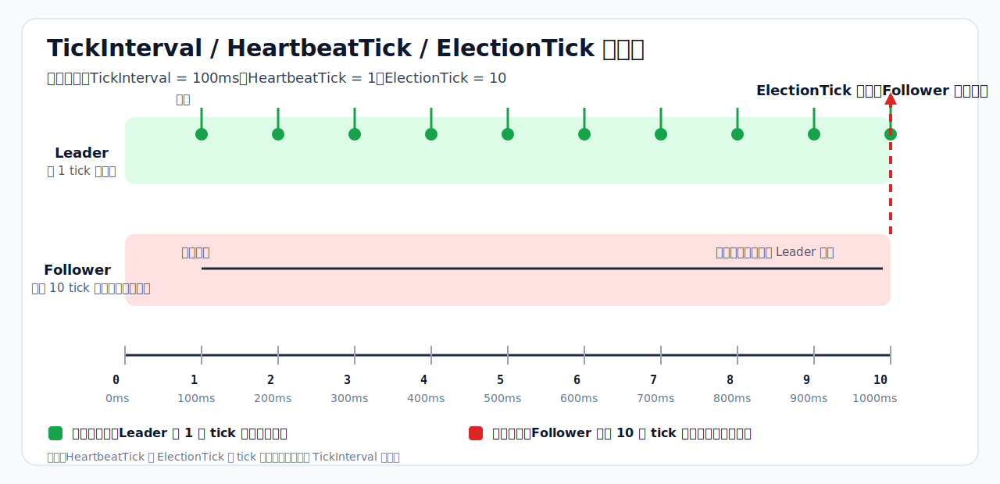

# Raft 时间参数说明

这份文档专门解释 `internal/raftnode/config.go` 里的三个时间相关参数：

- `TickInterval`
- `HeartbeatTick`
- `ElectionTick`

它们不是三个彼此独立的时间参数，而是一套组合起来工作的机制。



## 一句话理解

- `TickInterval`：Raft 内部逻辑时钟每走一步所对应的真实时间。
- `HeartbeatTick`：Leader 每隔多少个 tick 发送一次心跳。
- `ElectionTick`：Follower 连续多少个 tick 没收到 Leader 消息后，认为 Leader 可能失效并发起选举。

## 三者的关系

`HeartbeatTick` 和 `ElectionTick` 本身不是“毫秒”，而是“tick 数量”。

所以真正的时间要这样换算：

- 心跳周期 = `TickInterval * HeartbeatTick`
- 选举超时 = `TickInterval * ElectionTick`

以当前默认值为例：

- `TickInterval = 100ms`
- `HeartbeatTick = 1`
- `ElectionTick = 10`

那么实际含义就是：

- Leader 大约每 `100ms` 发一次心跳
- Follower 大约在 `1s` 没收到 Leader 消息后发起选举

## 1. TickInterval 是什么

`TickInterval` 是 Raft 的“基础节拍”。

在当前实现里，`raftnode` 会周期性调用：

```go
n.raftNode.Tick()
```

每调用一次，Raft 内部就认为“过去了 1 个 tick”。

所以 `TickInterval` 的作用是：把“tick”这种逻辑时间单位，映射成真实世界里的时间。

### 为什么必须有它

因为 `etcd-io/raft` 是一个状态机库，它不会自己开定时器去感知“100ms 过去了”。

外部必须定期调用 `Tick()`，否则：

- 心跳不会推进
- 选举超时不会推进
- Leader 失效后不会自动重新选主
- 整个 Raft 的时间相关行为几乎都会停住

### 没有它会怎样

如果完全不调用 `Tick()`，那就相当于 Raft 的“时间静止了”。

这时：

- Follower 不会因为超时而发起选举
- Leader 不会按节奏发送心跳
- 集群无法依赖时间机制维持领导者状态

## 2. HeartbeatTick 是什么

`HeartbeatTick` 表示 Leader 多少个 tick 发一次心跳。

它控制的是 Leader 告诉 Follower：

> 我还活着，当前任期仍然有效，不要发起选举。

它本质上控制了“心跳频率”。

### 配置过小会怎样

- 心跳更频繁
- 故障感知更快
- 网络和调度开销更高

### 配置过大会怎样

- 心跳更稀疏
- Follower 更久才知道 Leader 还活着
- 容易放大抖动带来的误判

## 3. ElectionTick 是什么

`ElectionTick` 表示 Follower 在连续多少个 tick 没收到 Leader 消息后，触发选举。

这里的“Leader 消息”不只是显式心跳，也可能包括正常复制日志消息。

所以它本质上控制的是：

- Follower 认定 Leader 失效的耐心有多大

### 为什么必须大于 HeartbeatTick

因为：

- `HeartbeatTick` 是 Leader 正常汇报的间隔
- `ElectionTick` 是 Follower 判定 Leader 失联的超时

如果 `ElectionTick <= HeartbeatTick`，就可能出现：

- Leader 还没来得及发下一次心跳
- Follower 就先超时了

这样会导致：

- 误触发选举
- Term 抖动
- Leader 频繁切换
- 写请求不稳定
- 集群整体吞吐下降

所以当前代码里有明确校验：

```go
if c.ElectionTick <= c.HeartbeatTick {
    return errors.New("raftnode: election tick must be greater than heartbeat tick")
}
```

## 时间线怎么理解

结合上面的图来看：

- 每 `100ms` 发生 1 个 tick
- Leader 每 1 个 tick 发一次心跳
- 如果 Follower 连续 10 个 tick 没收到 Leader 消息
- 那么它会在大约 `1000ms` 时认为 Leader 可能挂了，并进入选举流程

这就是为什么这三个参数一定要一起看，而不能只看单个字段。

## 调参建议

对当前项目，默认值已经比较合理：

- `TickInterval = 100ms`
- `HeartbeatTick = 1`
- `ElectionTick = 10`

这意味着：

- 心跳周期 `100ms`
- 选举超时约 `1s`

如果后续部署环境网络更差、机器抖动更明显，可以优先考虑：

- 保持 `HeartbeatTick` 不变
- 适度增大 `ElectionTick`

而不是盲目把 `TickInterval` 改得很小。

## 结论

可以把这三个参数记成一句话：

- `TickInterval` 决定“1 个 tick 是多长时间”
- `HeartbeatTick` 决定“Leader 多久发一次心跳”
- `ElectionTick` 决定“Follower 多久没收到消息就重新选主”

只有三者一起配置，Raft 的心跳和选举机制才有完整意义。
